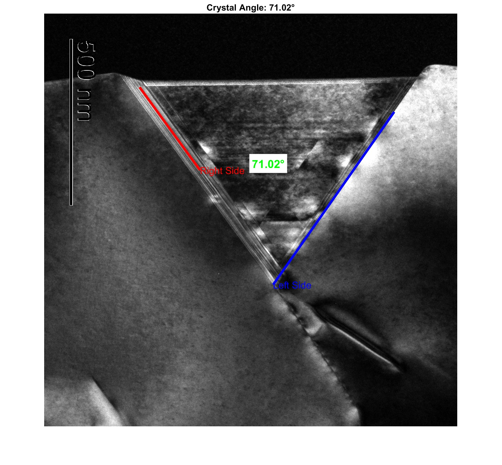
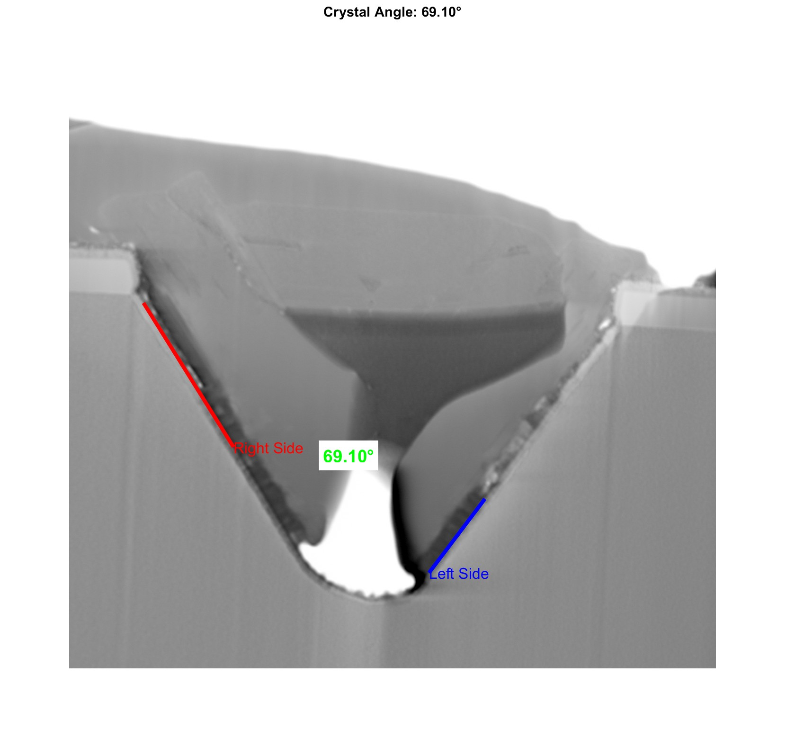
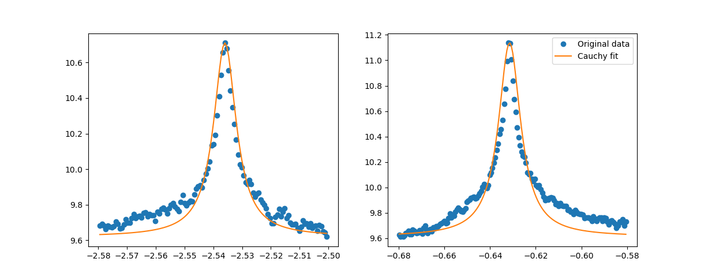
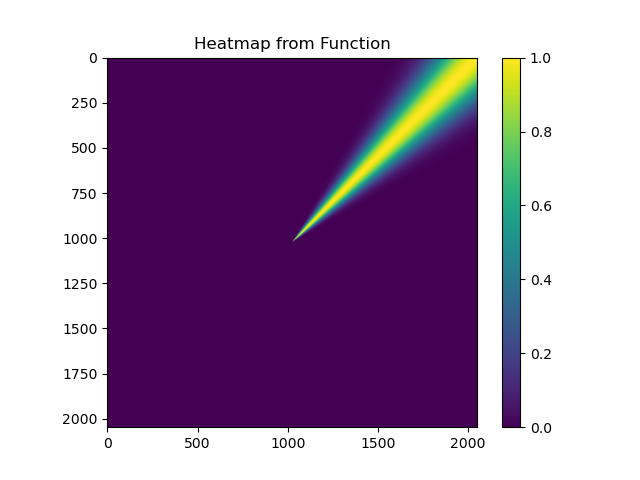
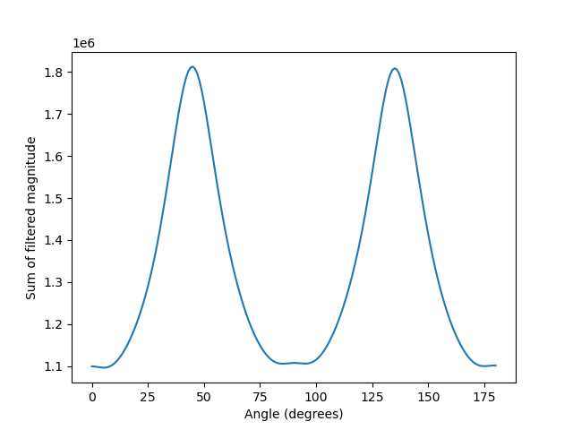
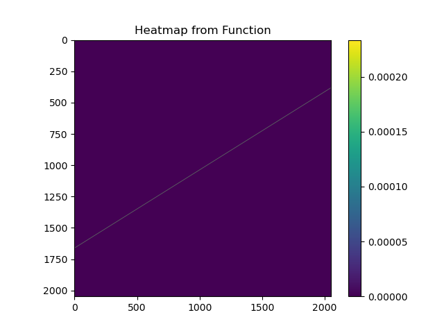
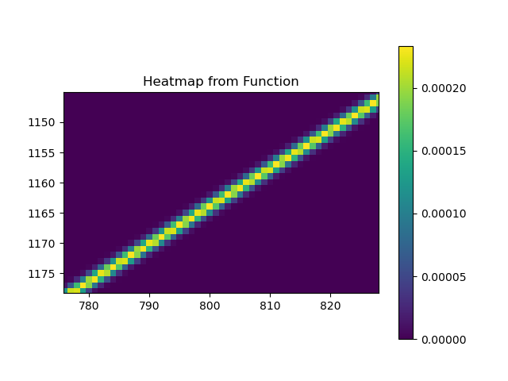
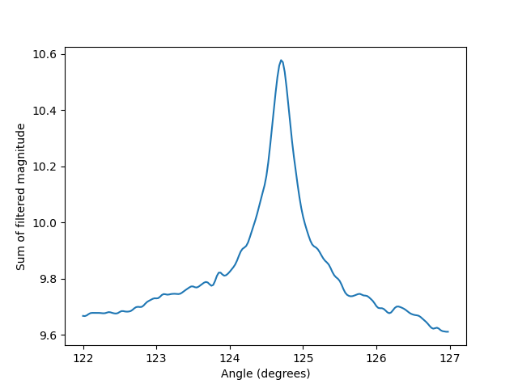
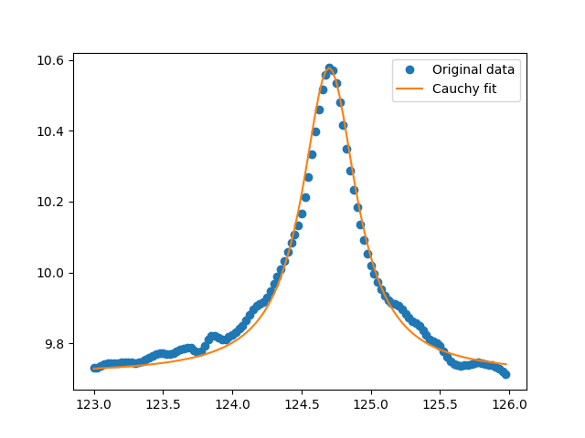

# Angle Detector for Microscopic Images

The Purpose of this project is to extract a precise angle with error measure from a single image from a TEM or SEM.

### Documentation of Implementation Process (from worst to best):

### 1. OpenCV Methods (edge + line detection)
MATLAB `experiment.m` --> `angle-detector.py` \

Implementation steps:
1. Gaussian blur image
2. Canny edge detection
3. Hugh line detection on canny edges
4. Filter detected lines by angle ranges to separate into two groups
5. Extract line parameters and convert to Cartesian coordinates
6. Classify lines based on theta angle thresholds
7. Draw filtered lines on separate images with different colors
8. Calculate mean and std for each line group
9. Compute angle between the two line groups
10. Visualize results

  
  

### 2. Extract Brightness Values by Angle
`brightness-along-ray.py` \
Overview:\
Summing pixel brightness of FFT image by shooting a a line from center to all border pixels in the top half of the image. Plot brightness values along line against the angle of the line. Fit cauchy curve to the plot in the 2 angle regions of interest.

Implementation steps:
1. Convert image to frequency representation

    

2. Calculate and store the border pixel coordinates into seperate arrays (right, top, left)
3. Iterate through each coordinate array, calculate and store the mean of all pixel brightness along the ray shot from the center pixel to a border pixel, calculate and store the angle of each ray
4. Above steps result in 2 arrays of brightness values (y-values) and angle values (x-values)

    

5. Fit Cauchy curve to the brightness and angle values with an initial guess for the location and scale parameters using the known values
6. Visualize the curve fit against the brightness values

    

### 3. Use Modified Gaussian as Weights to Extract Brightness by Angle
`ray-filter.py` and `beam-filter.py` \
(first try at implementing this idea) ray-filter Gaussian weight:

  
  

(refined implementation) beam-filter Gaussian weight:

Implementation steps:
1. Convert image to frequency representation
2. Create a grid of cartesian coordinates (width and height of grid equal to image) and turn them into a grid of angles [-pi, pi]
3. Use a modifies Gaussian equation parameterized by angle and thickness:
The beam weight function is defined as:

$$
w(\theta, X, Y, t) = \exp\left(-\frac{(X \cos\theta + Y \sin\theta)^2}{t^2}\right)
$$

&emsp;Where:
- $\theta$ is the beam angle (radians)
- $X, Y$ are the coordinate matrices
- $t$ is the thickness parameter

    
    

4. Iterate through the range containing the angle of interest, take dot product of w(\theta, X, Y, t) and frequecy image, and store resulting brightness value

    

5. Fit Cauchy curve to the brightness and angle values with an initial guess for the location and scale parameters using the known values
6. Visualize the curve fit against the brightness values

    

**Result:**  [location = 124.69892505, scale = 0.23766967]